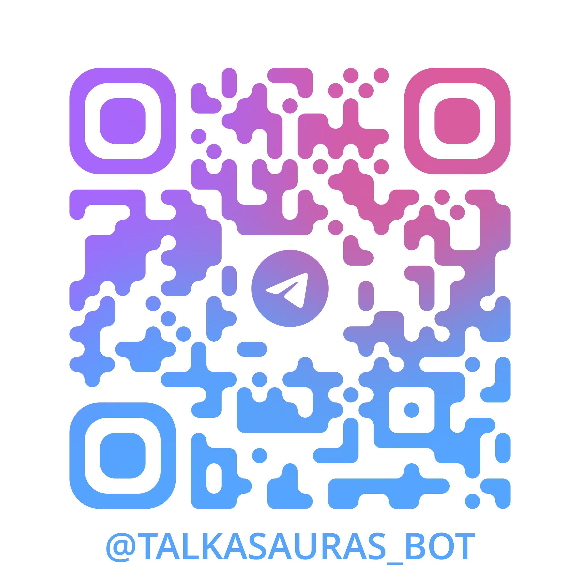

# Talkasauras

An AI-powered Telegram bot providing intelligent conversational capabilities with advanced features and self-hosting capabilities.

     

## Overview

Talkasauras is a feature-rich Telegram bot that leverages AI technology to provide natural language interactions, image understanding, and intelligent reminder management. it utilizes modern containerization and caching strategies for optimal user experience.

## Features

### Core Capabilities

- **Text-to-Text Conversations**: Engage in natural language conversations with AI-powered responses
- **Image-to-Text Analysis**: Upload images and receive AI-generated descriptions and insights
- **Contextual Messaging**: Maintains conversation context for coherent, multi-turn interactions
- **Temporary Chat Mode**: Separate temporary conversation context that automatically expires after 5 minutes of inactivity, with the ability to switch modes at any time

### Customization Options

- **Writing Styles**: Choose from multiple writing styles to suit your preferences:
    - Default
    - Formal
    - Descriptive
    - Concise
- **Custom Instructions**: Set personalized instructions to customize the bot's behavior and responses

### Advanced Features

- **Natural Language Reminders**: Set reminders using natural language (e.g., "March 7, 2026 at 2:48 PM") with high accuracy delivery
- **Admin Dashboard**: Dedicated admin bot for monitoring user analytics and application insights
- **Broadcast System**: Admin capability to send announcements and updates to all users

## Admin Bot Features

The admin bot provides:

- Real-time user analytics
- Application performance insights
- Broadcast messaging capabilities for announcements
- User engagement metrics

## Quick Start

Access the bot directly on Telegram:

**Bot Link**: [@talkasauras_bot](https://t.me/talkasauras_bot)

## Technical Architecture

### Technology Stack

- **Runtime**: Node.js
- **Language**: TypeScript
- **Database**: PostgreSQL with Prisma ORM
- **Caching**: Redis
- **Background Jobs**: BullMQ
- **AI Engine**: Ollama (self-hosted, platform-agnostic)
- **Containerization**: Docker with Docker Compose
- **Reverse Proxy**: Nginx (production)
- **Code Quality**: ESLint (linting) and Prettier (formatting)

### Infrastructure

The application is fully containerized using Docker:

- **Development Mode**: 5 containers
- **Production Mode**: 5 containers with Nginx reverse proxy for simplified deployment on a single port

### Key Components

- **Ollama Integration**: Self-hosted AI model inference for platform independence and data privacy
- **Redis Caching**: Fast response times through intelligent caching strategies
- **BullMQ Workers**: Reliable background job processing for reminders and asynchronous tasks
- **PostgreSQL + Prisma**: Type-safe database operations with robust data persistence

## Local Project Setup

Please refer to the [SETUP.md](./docs/SETUP.md) and [SCRIPTS.md](./docs/SCRIPTS.md) files for detailed instructions on setting up the project locally and running various scripts.

## License

This project is licensed under the MIT License - see the [LICENSE](./LICENSE) file for details.
