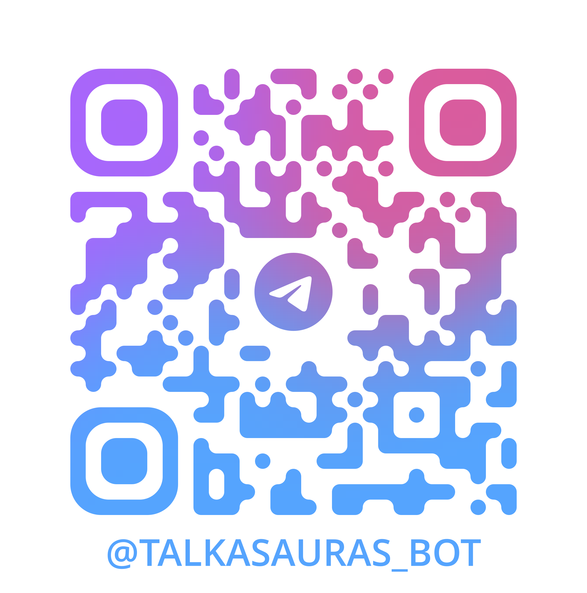
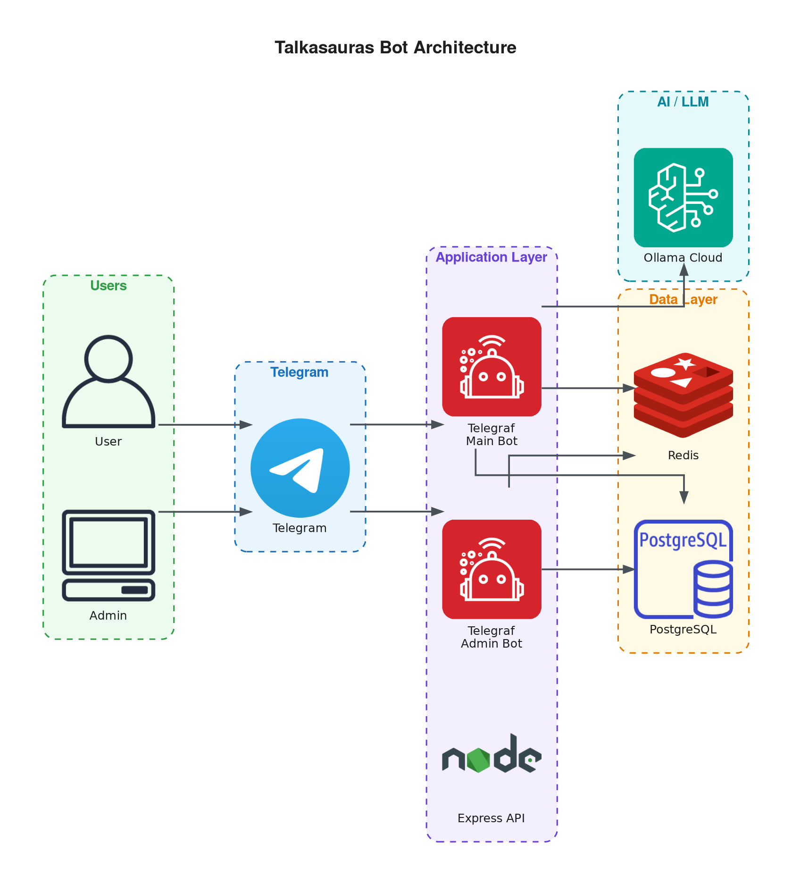

# Talkasauras Bot

A Telegram bot powered by Ollama LLM with real-time messaging, job queuing, and database persistence. Chat with an AI companion that remembers your writing style, handles scheduled reminders, and delivers daily engagement messages — all while keeping your data encrypted at rest.

  
  
<em>Scan to open the bot on Telegram</em>

## Features

- **AI Chat** — Natural conversations powered by Ollama LLM (supports vision for image captions)
- **Writing Styles** — Choose from Default, Formal, Descriptive, or Concise personality modes
- **Custom Instructions** — Teach the bot your preferred response style
- **Scheduled Reminders** — `remindme` command with natural language parsing (via chrono-node)
- **Daily Messages** — Automated daily engagement for inactive users (cron at 6 AM IST)
- **Temporary Mode** — Messages auto-delete after 5 minutes for privacy
- **Admin Panel** — Separate admin bot with broadcast, analytics, feedback review, and system status
- **Rate Limited** — 10 messages per 60 seconds per user (configurable)
- **Encrypted Storage** — All sensitive data encrypted with AES-256-GCM at rest

## Architecture

  

| Layer | Technology |
|-------|-----------|
| HTTP Server | Express 5 |
| Telegram Bots | Telegraf 4 (user + admin) |
| LLM | Ollama (local or cloud) |
| Job Queue | BullMQ + Redis |
| Database | PostgreSQL via Prisma |
| Encryption | AES-256-GCM / HMAC-SHA256 |
| Logging | Pino structured logger |

## Tech Stack

- **Runtime:** Node.js 24+, TypeScript 5.9
- **Package Manager:** pnpm 10
- **Infrastructure:** Docker Compose (Redis, PostgreSQL, Ollama)

## Setup

See [Setup Guide](docs/SETUP.md) for complete instructions covering:

- Environment configuration (Telegram bot tokens, encryption keys, API credentials)
- Development mode with Docker Compose + local Ollama
- LLM model installation in the Ollama container
- Production deployment with a single `docker compose up` command
- Troubleshooting common issues

## Bot Commands

### User Commands

| Command | Description |
|---------|-------------|
| `/start` | Welcome message and introduction |
| `/help` | Display this list of commands |
| `/about` | Learn more about Talkasauras Bot |
| `/contact` | View the developer's contact details |
| `/feedback` | Share your valued feedback |
| `/remindme` | Schedule a reminder for a future date and time |
| `/clear` | Clear your entire conversation history |
| `/current_mode` | Check your current chat mode |
| `/temporary_on` | Enable temporary chat mode |
| `/temporary_off` | Disable temporary mode and delete temp messages |
| `/custom_instructions` | Set personalized instructions for the bot |
| `/clear_instructions` | Clear your custom instructions |
| `/writing_style` | Choose your preferred writing style |
| `/subscribe` | Re-enable daily messages if you've unsubscribed |

### Admin Commands

| Command | Description |
|---------|-------------|
| `/start` | Welcome message with available commands |
| `/help` | Display command help |
| `/broadcast [subscribed\|all\|active24h]` | Start targeted broadcast flow |
| `/feedbacks [limit]` | Review latest unreviewed feedback |
| `/analytics` | View product analytics |
| `/status` | View runtime and queue status |
| `/whoami` | Show your Telegram identity details |
| `/cancel` | Cancel pending admin flow |

## License

[MIT](LICENSE) — Copyright (c) 2026 Dev Trivedi
